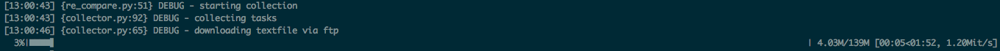
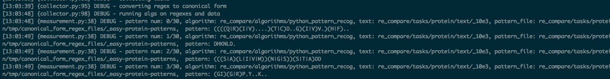
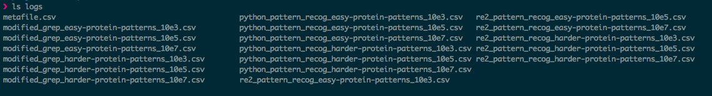
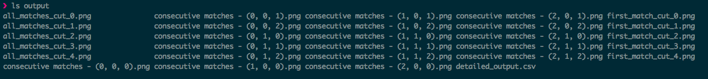
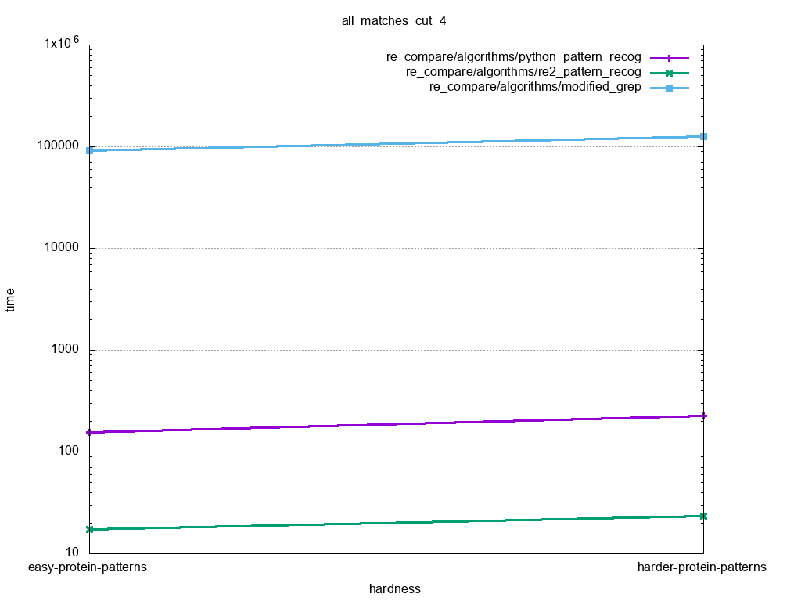

Re-Compare
=====

A modular configurable platform for comparing pattern matching algorithms with state-of-the-art baseline algorithms.

## Features

[comment]: # (TODO link mathematical documentation)

* Runs user defined workloads on state of the art algorithms and tracks their performance
* Analyzes algorithm performance across user defined parameter space [See Problem space documnetation](./doc/Problem_Space.pdf)
* Parses regexes in multiple regex syntaxes and converts them
* Random regex generator with user defined operation syntax, alphabet and depth

## Contents
- [Installation](#installation)
- [Getting Started](#getting-started)
- [Output example](#output-example)
- [Usage](#usage)
- [Translator syntaxes](#translator-syntaxes)
- [Changing-the-parameters-of-the-cube](#changing-the-parameters-of-the-cube)
- [Adding algorithms](#adding-algorithms)
- [Adding datasets](#adding-datasets)
- [Output structure](#output-structure)
- [Log format](#log-format)
- [Regex translation](#regex-translation)
- [Random regex generator](#random-regex-generator)
- [Default datasets](#default-datasets)
- [Default Algorithms](#default-algorithms)
- [Future work](#future-work)
- [Contributing](#contributing)
- [License](#license)


## Installation
**TEMPORARY**

Install python 3.6.5 (and pip3), then clone the repo and cd into it:
```bash
$ git clone https://github.com/gchase/re-compare
$ cd re-compare
```

add the directory into PYTHONPATH:
```bash
export PYTHONPATH="${PYTHONPATH}:$(pwd)"
```

Install dependincies with the following script (it'll require sudo for installing the baseline algorithms)
[//]: #( TODO add sudo to install)
```bash
bash utils/install.sh
```

Change directory into the main module, where the main execution file `re_compare.py` and the tests dir are located.
```bash
cd re_compare
```

[//]: #( TODO explain that run test is for system verification and for tutorials)
To run tests:
```bash
pytest tests
```

## Getting Started
re-compare is constructed of 3 major modules
* Regex translator
* Collector
* Cube-Analyzer

The **Regex translator** builds an [AST](https://en.wikipedia.org/wiki/Abstract_syntax_tree) for a regex pattern and allows converting multiple regex syntaxes to a common basic syntax (See [Translator syntaxes](#Translator-syntaxes))
For usage see [Regex translation](#regex-translation)


The **Collector** takes datasets in a a user friendly format (see [Adding datasets](#Adding-datasets))and Regex matching algorithms executables (see [Adding Algorithms](#Adding-Algorithms)). It translates the regexes to a syntax that each Alg supports, using **Regex translator**, runs the regexs tasks on each Alg and records the timing of each algorithm.

The **Cube-Analyzer** takes the logs of the **Collecter**, and outputs graphs and logs of statistical comparisons of the algorithm across every parameter in the user defined [Parameter Space](link to math viggentes).

Lets try to add our Alg , *Regexinator*, to re-compare and run it on the preset *Protein-dataset*
  From the recompare main directory
```bash
  # adding alg executable to alg directory
  mv ~/my_dir/Regexinator.o algorithms/
```
[//]: #( TODO make a running example and make sure it is consistent with all graphs and future examples)
Add this algorithm to the ALGORITHMS array at the re_comapre global config file:
```python
  # re_compare/config.py

  ALGORITHMS = [
  	"re_compare/algorithms/baseline_alg_1",
	"re_compare/algorithms/baseline_alg_2",
	"re_compare/algorithms/Regexinator.o" # ADDED
	]
```

Now we run our algorithm
```bash
  $ ./re_compare --task tasks/proteinDS
```

  

  

[//]: #( TODO explain with snap shot where the log and output format are, consider changing the name of logs since it is not debugging info but actual outputs)
After the process finishes, the logs directory is populated with measurements logs, created by the **Collector** module:

  

and the output directory is populated with graphs, created by the **Analysis** module:

  


## Output example

- logfile example
  ```text
  regex,matchtype,matchnumber,time(ms),span
  G|S|T|A|D|N|E|K|R,first_match,1,781,"[2, 2]"
  G|S|T|A|D|N|E|K|R,consecutive,1,781,"[2, 2]"
  G|S|T|A|D|N|E|K|R,consecutive,2,4,"[3, 3]"
  G|S|T|A|D|N|E|K|R,all_matches,2,785,"[-1, -1]"

  ```

- Example plots

  .png)

  


## Usage


-  To perform measurements and analysis, run

```
$ ./re_compare/re_compare --task <path_to_task>
```

[//]: #( TODO explain what a task is brifly and link to the default taks and the task structure section)
Note that the configuration specified `config.py` must match the task (see documentation in [config](config.py))

[Default](#Default-datasets) tasks, can be found in the tasks directory
```
$ ./re_compare/re_compare --task re_compare/tasks/<dir_name>
```

[//]: #( TODO explain what the usage cases for cube pnly analysis are)
- To perform only the cube-analysis, given log-files of correct format (See [Log format](#log-format))
```
$ ./re_compare/re_compare --log_files   <path/to/logfiles/>*
```
## Changing the parameters of the cube

See documentation inside [config.py](config.py)


## Translator Syntaxes
[//]: #( TODO rephrase this)
[//]: #( TODO say python syntax and not re2 syntax, fix broken link to an explanation of python extended syntax)
[//]: #( TODO explain that extended is both a supported syntax and the intermidiate represenataion and add the flowchart with the many-to-one-to-many explanation)
The translator supports converting all supported syntaxes to python [re2](ocs.python.org/3/library/re.html) syntax.
It also allows converting an re2 pattern to the basic syntax.

**Basic syntax:**
The basic regex syntax supports the following operations:
`terminals` - letters digits and all printable characters.
also supports escaped characters in both `\\n` or `\\t` format or `\\x00` format with two hex digits.
`|` - Or operator
`()` - Group operator, useful for defining precedence, etc...
`*` - Star operator. Concatenate the pattern to itself 0 or more times.

**Proteins:**
Full description of the proteins regex syntax can be found [here](http://www.hpa-bioinfotools.org.uk/ps_scan/PS_SCAN_PATTERN_SYNTAX.html).

## Adding algorithms
[//]: #( TODO change the word pattern to regex globally)
All pattern matching algorithms tested in this library have the following signature:
[//]: #( TODO correct this to be an executible and explain in more detail what we require)
[//]: #( TODO explain that each alg will run on all regexes and text pairs in the given task)
```python
algorithm(pattern_string, path/to/textfile)
```
The only output that is captured is output that start with the the prefix `>>>>`, other output is ignored.
The output format is a json string, with keys `match,span,time` that correspond with each nth match's string-match, its span in the text, and the __delta__ from the previous match. When the algorithm reaches EOF, it must output a last match, with the match "EOF", span `[-1,-1]` and the delta time from the previous match (or begining of run, if there were not matches). For example:
```
# in file example.txt
abc is easy as 123
abc

$ ./modified_grep "abc|123" example.txt
>>>>{"match": "abc", "span": [0,2], "time": 840}
>>>>{"match": "123", "span": [15,17], "time": 63}
some_output_that_doesn't_start_with '>>>>' hence is ignored
>>>>{"match": "abc", "span": [19,21], "time": 5}
>>>>{"match": "EOF", "span":  [-1,-1], "time": 21}

$ ./modified_grep "mooooooooo" example.txt
>>>>{"match": "EOF", "span":  [-1,-1], "time": 888}
```

## Adding datasets
The task structure is dependant on the **ordered** values in `config.PARAMETER_SPACE`. This dependency is what the section explains.
For clarity, we assume the parameter space looks like this:
[//]: #( TODO explain generalisability of the param space, do this with both a general case and the example from the running example)
```python
PARAMETER_SPACE = OrderedDict({
	'regex_space': [
		('hardness',["easy", "hard"]),
		('depth',["shallow","deep"])
	],
	'text_space': [
		('length', ['10e3', '10e5', '10e7'])
	]
})
```
[//]: #( TODO explain what both subdirectories are, make an ls example and link to default database folder and explain that they are in the same format)
[//]: #( TODO explain whose name correspond to what maybe view of the configfiles)
[//]: #( TODO make sure each config file is given a different name)
Both subdirectories have files with names that correspond to a selection of values from their space. Each such file start with either a `_` char, or `<some_prefix>_` as displayed below
- The regex subdirectory has files whose names correspond with the `regex_space` in the `PARAMETER_SPACE`. So for the example above, the `regex` subdirectory will hold files with names
```text
_easy_shallow
<some_prefix>_easy_deep
_hard_shallow
_hard_deep
```
[//]: #( TODO rephrase this paragraph)
[//]: #( TODO add the grep problems into the git issues)
[//]: #( TODO add that each file is 1 text document which is different from the regex case. Talk about future work in expanding this)
Each file holds one regex pattern per line. These patterns can be either in exteded regex patterns, or with any pattern that the `regex_converter` module can convert to extended regex patterns (see next bullet for more details)
- The text subdirectory can either be empty - in which case the text will be downloaded as explained in the next bullet - or hold a similar structure to the regex dir:
```text
_10e3
_10e5
<dont_care>_10e7
```
where each file holds a textfile that all patterns from all of the files in the regex dir will be tested on.
[//]: #( TODO explain text loading and automatic text removal)
[//]: #( TODO rephrase this paragraph)
- a local configuration file called `_config.py` must also be present in the task dir, and it must assign a value to a `regex_type` constant. This constant is used by the `regex-converter` module in order to convert all the patterns from their own grammar to a simplified extended regular expression grammar. Currently, this module supports convertion from Gooogle `re2` format and from `protein_patterns` grammar used in the `protein` task. Adding parser's to this convertion process will add support to more regex types.

[//]: #( TODO add power user section with intro to code diving and explain who is a power user)
## Output structure

[//]: #( TODO explain what canonical form is or change the wordings)
[//]: #( TODO explain what cannonical form is with figure)
- The extended form regular expressions, converted from the task's patterns, are stored at `path/to/task/tmp/canonical_form_regex_files`
- Logs from the collection stage (in format [Log Format](#log-format)) are stored at `./logs`
- Output plots are located at `./output`, where plot types are specified in `config.OUTPUT_TYPES`

[//]: #( TODO change dot to point add reference to running example)
[//]: #( TODO reword the the term index and explain with example)
[//]: #( TODO show example of the dot file to explain the meta data header line)
	For each dot in the parameter space, a consecutive matches file will be created, with its parameters listed inside. It's index in the parameter cube is part of the title.

[//]: #( TODO explain what first match and all matches are somewhere as well as consectuive)
[//]: #( TODO explain the order of the output structure)
[//]: #( TODO add that the log is ment to querying since its CSV)
	For each possible cut in the parameter space, a `first_match` and `all_matches` plot is created, where its parameters are specified at `detailed_output.csv`

## Log format
- For each selection of algorithm from `config.ALGORITHMS` and parameters from all lists specified in `config.PARAMETER_SPACE`, a log file __must__ be supplied with the format:
	```csv
	regex,matchtype,matchnumber,time(ms),span
	```
	where `regex` is an __extended form regular expression__, matchtype is one of `consecutive, first_match, all_matches`, and span is in format `[n,n + <size_of_match>]`

- A file called `metafile.csv` must also be supplied, where the parameters of each logfile in the previous bullet is specified in the following format:
	```csv
	filename,taskname,alg_name,regex.param_name_1,regex.param_name_2,...regex.param_name_n,text.param_name_1,text.param_name_2,...,text.param_name_n
	<file_path>,<task_name>,<regex_param_1_value>,<regex_param_2_value>,...
	```
	For example, for a parameter space:
	```python
	PARAMETER_SPACE = OrderedDict({
			'regex_space': [('hardness',["easy", "hard"])],
			'text_space': [('length', ['10e3', '10e5', '10e7'])]
	})
	```
	and algorithm list
	```python
	ALGORITHMS=("grep","egrep")
	```
	the metafile will look like this (note that file names are named appropriately for convenience, but their names are not part of the analysis, just the param columns):
	```csv
	filename,taskname,alg,regex.hardness,text.length
	grep_easy_10e3.csv,path/to/task,grep,easy,10e3
	grep_easy_10e5.csv,path/to/task,grep,easy,10e5
	grep_hard_10e3.csv,path/to/task,grep,hard,10e3
	grep_hard_10e5.csv,path/to/task,grep,hard,10e5
	egrep_easy_10e3.csv,path/to/task,egrep,easy,10e3
	.
	.
	.
	```

## Regex translation
Currently, we have 3 different parsers for the 3 supported syntaxes: `BasicAstParser`, `Re2Parser` and `ProteinParser`.
Description of the syntaxes can be found in the [Translator syntaxes]((#Translator-syntaxes]) section.

The regex parsers are using the python [ply library](http://www.dabeaz.com/ply/).
ply is a python lex/yacc library which allows building [lalr1](https://en.wikipedia.org/wiki/LALR_parser) grammars.

**usage:**
In the project's root directory run the following commands:
```
python
from re_compare.regex_converter.re2_ast.re2_parser import *
p = Re2Parser()
tree, groups, named_groups = p.parse('a|b') # Could be any valid re2 pattern pattern
basic_syntax_tree = p.convert_re2_tree_to_basic_syntax(tree, groups, named_groups)
basic_syntax_pattern = basic_syntax_tree.to_basic_string()
print(basic_syntax_pattern)
```

First, we import the re2 parser. Then we create an instance of an re2 parser.
The parse method gets a pattern and return a tuple containing the build AST, groups and named groups (named groups are not yet supported, but referring groups by index works)
Here, it's possible to print the tree with the `to_re2_string()` method.
To convert the tree use the `convert_re2_tree_to_basic_syntax` method with the same tuple elements that parse returned.
This method returns an AST in the basic syntax, which supports the `to_basic_string()` method in order to print it.

**Building your own parser:**
First step is to define the tokens for the syntax.
Easiest  way to do so is using literal strings.
In some complex situation there's a need for regular expressions.
At first, define the logical name of each token in a 'tokens' variable.
For example:

    tokens = (
    'DIGIT',
    'PLUS',
    'MULT'
    )

Now define regular expression patterns to match each token using t_<TOKEN_NAME> convention:

    t_MULT = r'\*'
    t_PLUS = r'\+'
    t_DIGIT = r'[0-9]'

If needed you can also create a function instead of a single regex.
An error handler can be defined like this:

    def t_error(self, t):
        print("Illegal character '%s'" % t.value[0])
        t.lexer.skip(1)

After you got your lexer working you need to define the grammar rules.
ply allows generic LALR grammars which should be ok for most reasonable syntaxes
Some grammars may have conflicts regarding which rule should be used in the case where multiple rules can derive the samee expression.
For example we want a calculator to use multiplication before addition in an expression like '1+2*3'
In order to solve these conflicts use the 'precedence' table

    precedence = (
    ('left', 'MULTIPLY'),
    ('left', 'PLUS'),
    )

The precedence table specifies the order between operators and the correct way in which to derive the expressions.

In this example multiplication will precede addition and the left argument would be calculated first.
Finally, its time to define the actual grammar rules.
Use the convention `p_<RULE_NAME>`
I suggest using a class for the parser but it's not necessary.
Rules are defined like the following example:

    def p_star(self, p):
        """expression : expression STAR"""
        p[0] = Re2StarNode(p[1])

The docstring is mandatory and tells ply exactly which expressions to match for this rule.
In our case we match any expression followed by a STAR token ('\*') in re2 syntax.

p is an array of the tokens of the expression we are currently deriving.
After the method ends p[0] holds the result of the current expression, in our case an ast.
We create an ast node for a star token using the ast of the sub-expression in p[1] which was already calculated.
Ast nodes all inherit from the base class Ast in generic_ast.py
They all have a member names sons containing a list of the sub-tree's (can be empty).
They also implement a basic `to_re2_string()` method (can be overriden by an inheriting class)
They all have a similar structure.
Here's an example of an OR ast node for re2 grammar:

    class Re2OrNode(Ast):
      def __init__(self, left_son, right_son):
          super(Re2OrNode, self).__init__()
          self.sons = [left_son, right_son]

      def to_re2_string(self):
          return '%s|%s' % (self.sons[0].to_re2_string(), self.sons[1].to_re2_string())
The or node has two sons (AST's of two expressions).
It implements the `to_re2_string()` method which prints the expression in re2 syntax, using the `to_re2_string()` method of the two sons.

For more information and examples see the official [documentation](http://www.dabeaz.com/ply) of ply.
The ply [calculator](http://www.dabeaz.com/ply/example.html) covers all common features pretty well.

**Editing a parser:**
The parsers here are written in optimized mode.
While much faster when parsing multiple strings, optimized mode also creates temporary files.
These files contain the state machine for the created parser (and some implementation)
Note that changing the python parser and running again will **NOT** change the state machine saved in the file.
Use `./removeTempFiles.sh` from the regex converter directory or remove them manually.

## Random regex generator
We build an in house random regex generator to test re-compare.
Its quite extendible and very easy to use.
The random regex generator can be found in the re_compare/random_generator/random_gen.py module.
Here is an example of our random regex generator
```python
>>> operations = ["%s%s", "%s|%s", "%s?", "%s+", "%s*", "(%s)"]
>>> alphabet = ["A", "C", "G", "T", "."]
>>> (min_depth,max_depth,oper_percent)=(3,5,50)
>>> reg=generate_random_regex(alphabet, operations, max_depth, min_depth, oper_percent)
>>> reg
[[['C', '|', [['(', 'G', ')'], '*']], ['A', '+']], '?']
>>> flatten_expression_tree(reg)
'C|(G)*A+?'
```
Regex relations and terminals are currently chosen uniformly from operations and alphabet respectivly.
Operations can have any arity and use printf like syntax where '%s' marks a sub-expression.
max_depth and_min depth limit the depth of the regex as a syntax tree.
oper_precent is the liklyhood that an operation will be chosen when depth is within bounds.

The resulting expression is given in a recursive list formula as shown above. Allowing easy manipulation and post processing of the generated regex.
flatten_expression_tree can be called to flatten the regex into string format.

## Default datasets

Currently we provide the following default datasets
* **Protein motifs**
Regexes are protein motifs taken from the [prosite](https://prosite.expasy.org) protein database. The regexes where extracted by a crawler and translated to extended regex format via our in house syntax [Translator](#Translator-syntaxes)
The text for this dataset is a file containing all protein sequences in the [PDB](https://www.rcsb.org/) protein database.

The motivation for this dataset came from the [paper](https://ink.library.smu.edu.sg/cgi/viewcontent.cgi?article=4157&context=sis_research) "Negative Factor: Improving Regular-Expression Matching in Strings"  by Yang et al.

* **DNA promoter sequences**
Regxes nucleotide Yeast promoter sequences taken via a crawler from the Yeast promotor sequence [database](http://rulai.cshl.edu/cgi-bin/SCPD/getfactorlist) Regexes were translated by a short script based on the [fasta](https://en.wikipedia.org/wiki/FASTA_format) format specification. These regexes are of the '.[]' form over [AGCT], meaning they are a concatenation of bracket sets or terminals over the nucleotide alphabet.
The text is the entire Saccharomyces cerevisiae (Baker's yeast) [Chromosome](https://downloads.yeastgenome.org/sequence/S288C_reference/chromosomes/fasta/)

The addition of this dataset was inspired by the [paper](https://ieeexplore.ieee.org/document/4359878/) "DNA Motif Representation with Nucleotide Dependency" by Chin et al.

* **Web packet analysis**
The web analysis tasks are composed of two regex sets that are matched on the same text.
Regexes are regexes extracted from the [Bro](https://www.bro.org/) and [Snort](https://www.snort.org/) web inspection systems. The regexes were manually extracted from the source code of the systems.
Texts are taken from the MIT [Darpa](https://www.ll.mit.edu//ideval/data/) project
TODO say which dataset specifically
These datasets were collected based on the [paper](https://ieeexplore.ieee.org/document/4579527/) "Fast and memory-efficient regular expression matching for deep packet inspection" by Yu et al.

* **English text**
Regexes for english text filtering tasks were manually picked from [regexlib](http://www.regexlib.com/Default.aspx).
Texts are a concatenation of all abstracts found on the [DBLP-Citation-network](https://aminer.org/citation).


## Future work
TODO this should be filled after the project is done and after consulting Benny
talk about signals
talk about itegration of classifiers and random generators
talk about random bison
talk about checkling regex params such as case sensitive etc
talk about constrained random text generators  (or genrerators by regex fit)


## Contributing
To contribute to the devlopment of re-compare, please contact Dean Light at light.skep@gmail.com

## License
	re-compare is released under the [MIT License](http://www.opensource.org/licenses/MIT).
  Liscence dependancies include:
  *TODO put dependancies here
